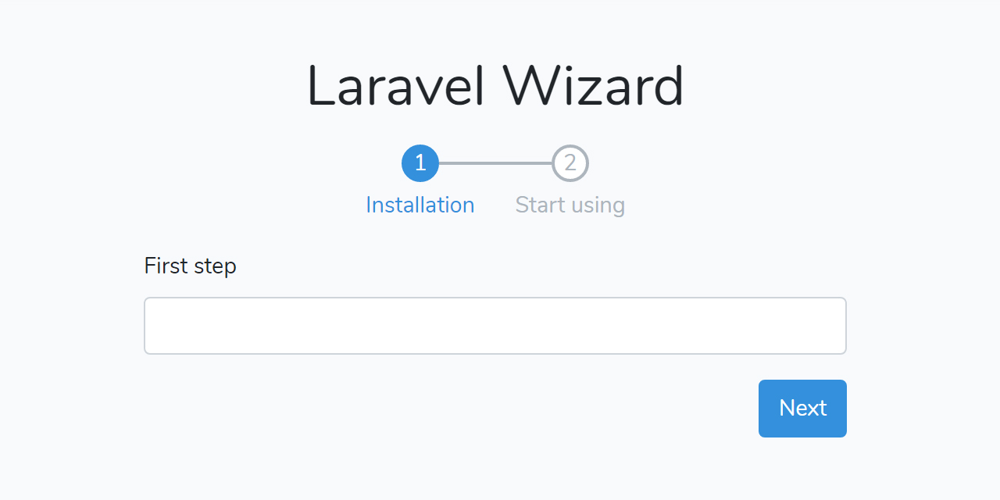

# Laravel wizard

[![Latest Version on Packagist][ico-version]][link-packagist]
[![Software License][ico-license]](LICENSE.md)
[![Build Status][ico-circleci]][link-circleci]
[![Total Downloads][ico-downloads]][link-downloads]

A web setup wizard for Laravel application.

> This package is adapted from [smajti1/laravel-wizard](https://github.com/smajti1/laravel-wizard).



## Install

Via Composer:

```bash
composer require ycs77/laravel-wizard
```

Publish config:

```bash
php artisan vendor:publish --tag=wizard-config
```

The this package view is use [Bootstrap 4](https://getbootstrap.com/), but if you don't want to use, you can publish views and translations to custom it:

```bash
php artisan vendor:publish --tag=wizard-resources
```

## Usage

### 1. Generate controller and wizard steps

Now you can quickly generate the wizard controller and the wizard steps:

```bash
php artisan make:wizard UserSetup NameStep,EmailStep
```

This command generate the `UserSetupWizardController`, `NameStep`, `EmailStep` class, and append the wizard route to `routes/web.php`.

*routes/web.php*
```php
...

Wizard::routes('wizard/user', 'UserSetupWizardController', 'wizard.user');
```

> If you can't use auto append route, you can set `config/wizard.php` attribute `append_route` to `false`.

### 2. Set steps

This is generated NameStep class, you can to `setModel` method get the model, to `rules` method set form validation, and save `$data` to your database via the `saveData` method:

*app/Steps/User/NameStep.php*
```php
<?php

namespace App\Steps\User;

use App\User;
use Illuminate\Http\Request;
use Illuminate\Support\Arr;
use Ycs77\LaravelWizard\Step;

class NameStep extends Step
{
    /**
     * The step slug.
     *
     * @var string
     */
    protected $slug = 'name';

    /**
     * The step show label text.
     *
     * @var string
     */
    protected $label = 'Name';

    /**
     * The step form view path.
     *
     * @var string
     */
    protected $view = 'steps.user.name';

    /**
     * Set the step model instance or the relationships instance.
     *
     * @param  \Illuminate\Http\Request  $request
     * @return void
     */
    public function setModel(Request $request)
    {
        $this->model = User::find(1);
    }

    /**
     * Save this step form data.
     *
     * @param  \Illuminate\Http\Request  $request
     * @param  array|null  $data
     * @param  \Illuminate\Database\Eloquent\Model|\Illuminate\Database\Eloquent\Relations\relation|null  $model
     * @return void
     */
    public function saveData(Request $request, $data = null, $model = null)
    {
        $data = Arr::only($data, 'name');
        $model->update($data);
    }

    /**
     * Validation rules.
     *
     * @param  \Illuminate\Http\Request  $request
     * @return array
     */
    public function rules(Request $request)
    {
        return [
            'name' => 'required',
        ];
    }
}
```

And add steps view, for example:

*resources/views/steps/user_setup/name.blade.php*
```php
<div class="form-group">
    <label for="name">Name</label>
    <input type="text" name="name" id="name" class="form-control{{ $errors->has('name') ? ' is-invalid' : '' }}" value="{{ old('name') ?? $step->data('name') }}">
    @if ($errors->has('name'))
        <span class="invalid-feedback">{{ $errors->first('name') }}</span>
    @endif
</div>
```

*resources/views/steps/user_setup/email.blade.php*
```php
<div class="form-group">
    <label for="email">E-mail</label>
    <input type="email" name="email" id="email" class="form-control{{ $errors->has('email') ? ' is-invalid' : '' }}" value="{{ old('email') ?? $step->data('email') }}">
    @if ($errors->has('email'))
        <span class="invalid-feedback">{{ $errors->first('email') }}</span>
    @endif
</div>
```

Next, browse the URL `/wizard/user_setup`, start use the Laravel Wizard.

### 3. Use wizard steps CSS package

This package is based on the [Bootstrap Steps](https://github.com/ycs77/bootstrap-steps) as the CSS package, use NPM installation to use:

```bash
npm install bootstrap-steps
```

Or use yarn:

```bash
yarn add bootstrap-steps
```

### Override wizard configuration on wizard controller

Add `wizardOptions` property to `controller`, you can use `cache`, `driver`, `connection`, `table` options to override configuration.

*app/Http/Controllers/UserSetupWizardController.php*
```php
/**
 * The wizard options.
 *
 * @var array
 */
protected $wizardOptions = [
    'cache' => false,
];
```

### Set step relationships model

Similarly, you can set the relationships model in `setModel` method of `Step`.

```php
use Illuminate\Support\Arr;

/**
 * Set the step model instance or the relationships instance.
 *
 * @param  \Illuminate\Http\Request  $request
 * @return void
 */
public function setModel(Request $request)
{
    $this->model = $request->user()->posts();
}

/**
 * Save this step form data.
 *
 * @param  \Illuminate\Http\Request  $request
 * @param  array|null  $data
 * @param  \Illuminate\Database\Eloquent\Model\Illuminate\Database\Eloquent\Relations\relation|null $model
 * @return void
 */
public function saveData(Request $request, $data = null,$model = null)
{
    $data = Arr::only($data, ['title', 'content']);
    $model->create($data);
}
```

## Commands

**Make controller**:

```bash
php artisan make:wizard:controller UserSetupController steps=NameStep,EmailStep
```

The `make:wizard` and `make:wizard:controller` difference, is `make:wizard` will append route and no confirm generate step.

**Make step**:

```bash
php artisan make:wizard:step NameStep
```

Or use options:

```bash
php artisan make:wizard:step NameStep --label="Name" --slug=name --view=steps.user.name --wizard=user
```

[ico-version]: https://img.shields.io/packagist/v/ycs77/laravel-wizard.svg?style=flat
[ico-license]: https://img.shields.io/badge/license-MIT-brightgreen.svg?style=flat
[ico-circleci]: https://img.shields.io/circleci/project/github/ycs77/laravel-wizard/master.svg?style=flat
[ico-downloads]: https://img.shields.io/packagist/dt/ycs77/laravel-wizard.svg?style=flat

[link-packagist]: https://packagist.org/packages/ycs77/laravel-wizard
[link-circleci]: https://circleci.com/gh/ycs77/laravel-wizard
[link-downloads]: https://packagist.org/packages/ycs77/laravel-wizard
